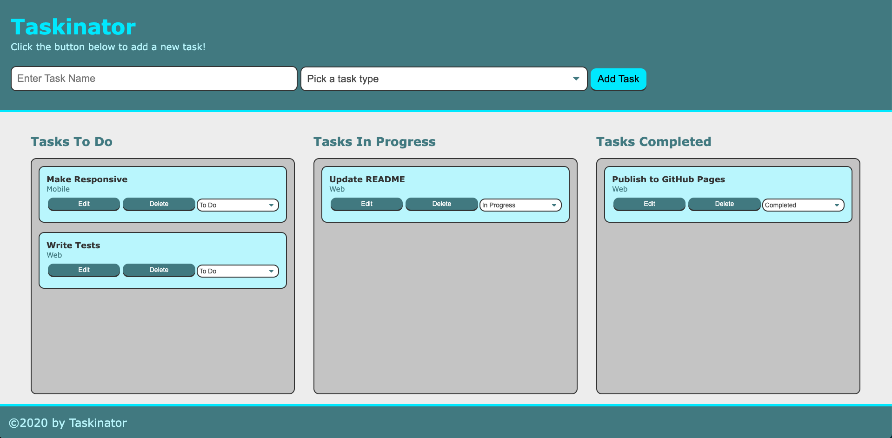

# ✅ Taskinator ✅

## About

Taskinator is simple yet effective to-do list app. A user is presented with a form to create a task and give it a type. Users can then track and manage tasks by choosing a task list. This app leverages local storage to store tasks and provide persistent data.

## 🏗 Built With 🏗

## 🔮 Plans For The Future 🔮

I feel this project is in a good place but could still use some improvements such as:

- Sort tasks by making them draggable
- Allow users to create custom task type

## 🔗 Links 🔗

- [Deployment](https://dzamanillo.github.io/taskinator/)
- [Repository](https://github.com/dzamanillo/taskinator)
- [My Github](https://github.com/dzamanillo/)
- [My Portfolio](https://dzamanillo.github.io/)
